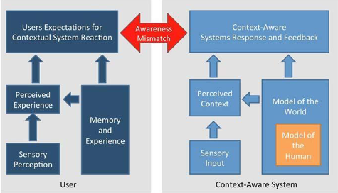
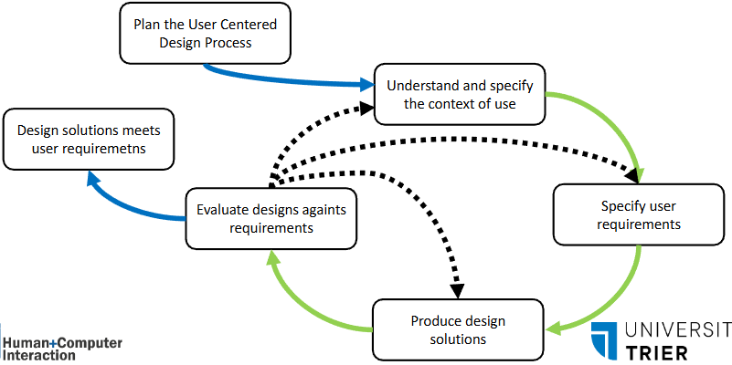

# Ubiquitous Computing

* Früher: Mainframe, one Computer, many People
* Dann: PC, one Computer, one Person
* Heute: Ubiquitous Computing: one Person, many Computers

Gepusht durch Smartphone

Mark Weiser 1991
The most profound technologies are those that disappear. They weave themselves into the fabric of everyday life, until they are indistinguishable from it.

beste Technologien jene die sich in den Alltag integrieren bis sie kaum wahrnehmbar sind
Eingebettete Prozessoren -> IOT

Technologien wie Bluetooth, NFC, IrDA, ZigBee, WiFi zur Kommunikation von Geräten entwickelt

Integration in den Alltag bis zur unsichtbarkeit
"invisible computing"

### Zusammenfassung der Eigenschaften

* Hoher Grad an Einbettung -> Technologie im Hintergrund
* Viele Geräte
* Hohe Vernetzung

**Prototypen & Zielsetzung**
* Dynabook
* ParcTab -> Elektronisches Papier
* ParcPad -> Kalender
* Liveboard -> Tafel
 ->
* Ersetzen klassischer Objekte
* Beibehaltung der Form
* Erweiterung der Funktionen

## Context awareness
z.B. ortsabhängig Informationen anpassen
Was ist Kontext?
- Personen & Geräte
- Zeit
- Ort
- Nutzer(rolle)
-> Alles was wichtig ist kann Kontext sein

Kontext beeinflusst nicht nur Entwicklung sondern auch Laufzeitnutzung
Sensoren erfassen Kontext -> Übersetzung in angepasste Features / Darstellung

Awareness Mismatch soll möglichst verhindert werden
Wahrnehmung des Systems möglichst nah an der Wahrnehmung des Menschen

### Sensortypen
* GPS -> Position und Geschwindigkeit
* Licht & Sicht -> Aktivitäts und Objektdetektion
* Mikrofon -> Geräusche, Aktivität und Sprache
* Accelerometer & Gyroscope -> Bewegung, Orientierung, Vibration
* Magnetfeldsensor -> Orientierung & Kompass
* Näherungs- & Berührungssensor -> Detektion von Benutzerinteraktion
* Temperatur / Feuchtigkeit / Luftdruck -> Umgebung
* Physiologischer Kontext des Nutzers -> EEG, ECG, Galvanische Hautreaktion
* uvm.

### Kontexttypen
* Kontext-Adaptive Systeme 
    * Basierend auf "Triggern" -> Kontext
    * Proaktive Applikationen -> Eigeninitiative
        * z.B. Heizung starten wenn Nutzer auf Heimweg
    * Adaptive Applikationen -> Funktionen werden angepasst, nicht ganze Anwendung
    * Entwicklung:
        * Definition von Kontexten
        * Definition von Anpassungen
        * Mapping zwischen Kontext und Anpassung
* Adaptive und Kontextbewusste UIs
    * Spezieller Fall, Funktionen Elemente der UI
    * Z.B. Displayhelligkeit wird an Umgebung angepasst
* Situative Unterbrechungen verwalten
    * Trigger von Außerhalb der aktuellen Tätigkeit
        * Aufmerksamkeitswechsel
        * evtl. störend
    * Kontext zur Planung von Unterbrechungen
* Datengeneration für Metadaten und Implizit Nutzer generierter Kontext
    * Sammeln von Metadaten
        * mehr Informationen über entstehung der Daten
* Kontextbewusste Resourcenverwaltung
    * z.B. automatisch Energiesparmodus aktivieren
    * Impliziter Einfluss

### Designhinweise für Kontextbewusste Nutzeroberflächen
1. Hierarchicher Feature space von Kontextfaktoren
2. Sensordaten anzeigen um Fehlinterpretationen erklärbar zu machen
3. Kontextparameter identifizieren und Sensoren suchen
4. Proaktive Anwendungen sehr schwierig, einfacher adaptiv mehrere Möglichkeiten vorzuschlagen
5. Automatische Anpassungen nur vorsichtig einsetzen und Verständlichkeit garantieren

## Affective Computing
* Emotionaler Zustand des Nutzers teil des Kontexts
* Emotionen sensorisch messbar
* Drei Sichtweisen:
    * Affective Computing (Picard)
    * Affective Interaction (Boehner)
    * Technology as Experience

### Affective Computing
**Definition**
Maschinen schaffen, die Emotionen oder andere affektive Phänomene berücksichtigen **oder** absichtlich beeinflussen

* Aus psychologischer, neurologischer oder medizinischer Perspektive betrachtet
* individuelles kognitives Modell von Affekt entwickeln und in digitalem System anwenden
    * System generiert Antwort aus generellen Regeln keinem vorgegebenen Vokabular
* Wird verknüpft mit Modell zur Detektion von Emotionen des Nutzers durch Sensormessung

**Technische Messung von Emotionen**
* Emotionale Sprache
    * Algorithmische Detektion, Machine Learning, etc.
* Messung von Gesichtsausdrücken
    * Datenbanken
    * Klassifizierer
* Körpergesten
* Physiologische Parameter
    * Herzrate, Blutdruck, etc.

### Affective Interaction
* Emotion als Teil der Interaktion
* Ziel nicht die klassifizierung von Emotionen, sondern darstellen von Parametern für Nutzer zur Selbstreflektion
* Interaktioneller designprozess nach Boehner et al.:
    1. Emotion als soziales & kulturelles Produkt
    2. Verlässt sich auf & unterstützt Interpretationsspielraum
    3. Versucht nicht unformalisierbares zu formalisieren
    4. Unterstützt erweiterte Reichweite von Kommunikation
    5. Fokussiert auf Nutzer die Emotionen verstehen wollen
    6. Fokussiert auf Systemdesign das Reflektion und emotionales Verständnis stimulieren

## Zusammenfassung UbiComp
* Verteilt
* z.T. geringe Rechenleistung
* Schnittstellen
* Welches Wissen benötigt?
    * Was ist verlässlich Messbar
    * Was ist verlässlich annehmbar
    * Was ist verlässlich herleitbar

### Datenunschärfe
* Umgang mit unscharfer Information problematisch
* Strategien:
    * Pessimistisch: Nur korrekte Informationen anzeigen
    * Optimistisch: Alles als korrekt angenommen
    * Vorsichtig: Unschärfe explizit angezeigt
    * Opportunistisch: Unsicherheit wird instrumentalisiert

* Bsp. GPS:
    * 500 - 30 cm Genauigkeit

### Wer ist der Nutzer?
* Mentale Randbedingungen
* Aufgaben und Ziele des Nutzers
* Mentales Modell

### Laufzeit
* Kontext passiert in Echtzeit, auch in Echtzeit muss geschehen:
    * Kommunikation
    * Verarbeitung
    * Rückmeldung
    * Entscheidung
* Häufig unvollständige Informationen
    * Lose Kopplung und Datenverlust
    * Geringe  Rechen- und Speicherkapazität
    * Verteiltheit