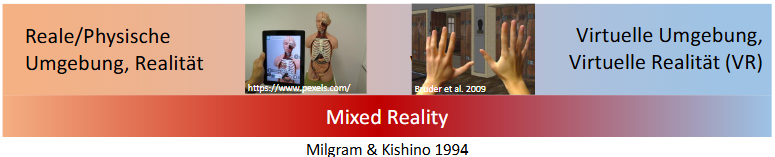
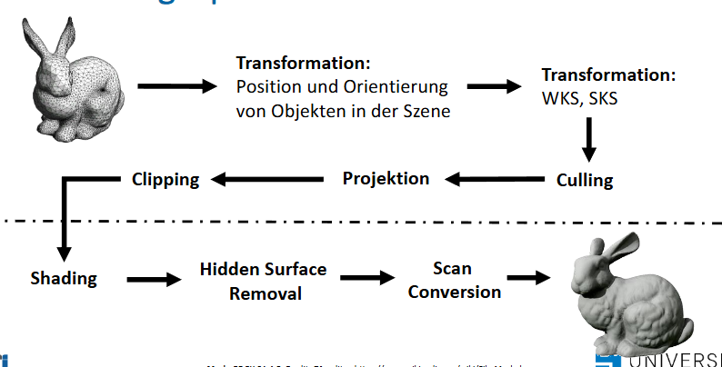
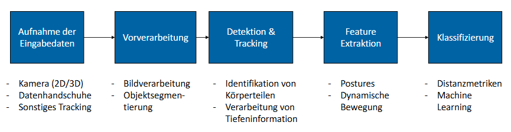

# Non Standard UIs

Definition:
Interaktionskonzepte die nicht auf quasi Standard Konzepten basieren wie z.B. Touchscreens, Maus & Tastatur etc.

## (Be)Greifbare Interaktion
* Voraussetzung & Ziel
    * Unsichtbarkeit von Compute -> Vision von Weiser
* Tangible Computing & Augmented Reality

**Ziel**
Zurückgewinnung der Physikalität von Interaktion, Verbindung und Vermischung von virtueller und physikalischer Realität

### Physische und virtuelle Objekte

#### Physical Is Better At (PIBA) - Digital Is Better At (DIBA)
* Manchmal physisches, manchmal digitales Objekt besser
* Orientiert sich an MABA - MABA (Men / Machines Are Better At)
    * Kritisiert da statisch
    * Erste Richtlinie
* 5 Kategorien

**Kategorien**    
1. Physische Substanz - Binäre Substanz
    * Eigentschaften physischer / virtueller Objekte aufgrund ihrer Substanz daher Materie
    vs. Digitale Darstellung
2. Räumliche - Nichträumliche Ausdehnung
    * Physische vs Digitale Ausdehnung (Bildschirm)
3. Räumliche Position - Allgegenwärtigkeit
    * Physische Objekte auf einen Ort beschränkt, auf virtuelle Objekte kann von überall aus zugegriffen werden
4. Räumliche Ortsbezogenheit - Referenzielle Ortsbezogenheit
    * Physische Objekte in räumliche Umgebung eingebettet, implizit verknüpft vs. virtuelle Objekte häufig durch Referenzen verknüpft
5. Analoges Interaktionsalphabet vs Digitales Interaktionsalphabet
    * Physische Objekte erzeugen immer Daten, Digitale Objekte digitale / diskrete Informationen

**PIBA - Physical Is Better At**
1. Physische Materie
    1. Intrinsische Eigenschaften können einfach wahrgenommen und begriffen werden
    2. Können physisch und mental gleichzeitig be- / begriffen werden
        * Sowohl Daten als auch Interaktion
        * Potentiell multimodal
        * Haptisches Begreifen verbessert mentales Verstehen
    3. Direkte, passive haptische Rückmeldung
    4. Einzigartig / eindeutig
        * Form, Textur
        * Lage, Position, etc
    5. Kein Betriebssystem / Infrastruktur nötig
    6. Physische Objekte Robust z.B. gegen Umwelt
2. Räumliche Ausdehnung
    1. Physische Objekte unmittelbar, ohne Ausrüstung wahrnehmbar
    2. Nutzer können bekannte Sensomotorische Fähigkeiten anwenden
        * Sinneswahrnemung + motorischer Apparat
        * Multimodal
        * Interaktion mit alltäglichen Objekten übertragbar
        * Beidhändige Interaktion
3. Räumliche Position
    1. Extrinsische mechanische Eigenschaften einfach manipulierbar
        * Ähnlich zu 1.1
        * Einfacher Bezug zu anderen Objekten
        * Auch außerhalb der gedachten Interaktion nutzbar
    2. Wahrnehmungs- und Handlungsraum perfekt aufeinander abgestimmte Einheit
        * Maus & Desktop trennen Handlungs- und Wahrnehmungsraum -> Bewegung Maus & Bewegung Mauszeiger
        * Im virtuellen große Lücken möglich
    3. Globaler Nutzungsrahmen für alle Nutzer gleich
        * Ermöglicht sehr kollaboratives arbeiten
    4. Erlauben parallele räumliche Multiplexkontrolle
    5. Inhärent dreidimensional
4. Räumliche Ortsbezogenheit
    1. Semantische Merkmale (natürliche Bedingungen)
        * Sammeln von Objekten kommuniziert zugehörigkeit
        * Physische Eigenschaften (gewicht etc.)
    2. Können von Nutzer angeordnet werden
        * Denkbar auch mischen mit nicht-interaktiven Objekten
5. Analoges Interaktionsalphabet
    1. Können schnell viele analoge Daten generieren

**DIBA - Digital Is Better At**
1. Binäre Substanz
    1. Eigenschaften von Objekten können einfach angepasst werden
    2. Können einfach durch Algorithmen verarbeitet werden
        * Schnelle Verarbeitung und Animation
        * Benötigt physisches Objekt um zu interagieren
    3. Können aus dem nichts entstehen und kopiert werden
    4. Können einfach gespeichert, zurückgesetzt und gelöscht werden
        * Nur im Speicher existieren
        * Transformation durch Serialisierung
        * Undo / Redo möglich
    5. Beschränkungen einfach möglich
        * Zugreifbarkeit auf internen Zustand (Kapselung)
    6. Sachverhalte können abstrahiert und reduziert werden
        * müssen nicht ganz beschrieben sein
        * Vereinfachte Objekte schon Nutzbar (Prototypen)
2. Nichträumliche Ausdehnung
    1. Geringe Wartungs und Lagerkosten
    2. Brauchen kaum physischen Platz
    3. Keine Physischen Beschränkungen
3. Allgegenwärtigkeit
    1. Auch an entfernten Orten verfügbar
4. Referenzielle Ortsbezogenheit
    1. Komplexe hierarchische und vernetzte Strukturen einfach abbildbar
5. Digitales Interaktionsalphabet
    1. Einfache Eingabe diskreter Zahlenwerte
        * Einfache und abstrakte Interaktionssprache

## Tangible Interaction
* Greifbarkeit des Interfaces
* Physische Darstellung von Daten
* Ganzkörperinteraktion
* Einbettung der Oberfläche und Interaktion in echtem Kontext

### Gestenbasierte Interaktion & Multitouch
**Orientierung für das Design**
* Fließende und direkter Stil der Interaktion durch Freihand und Stift-basierte Gesten
* Kernfragen u.a. ob Größe, Orientierung und Form Kollaboration beeinflussen
* Scrollen deutlich schneller durch Fingergesten
* Gesten für multitouch müssen gelernt werden, wenige Kerngesten bevorzugt
* Fehleranfälliger und schwerfälliger

* Gesten enthalten Bewegung von Armen und Händen
* Nutzt Kameras, Sensoren und Computer Vision Technologie
    * Erkennt Arm und Handgesten von Menschen im Raum
    * Gesten müssen der Reihe nach präsentiert werden um erkannt zu werden

**Gesten- und Blickbasierte Interaktion**
* Verschiedene Arten von Gesten:
    * Offline Geste
        * Geste nach Abschluss der Interaktion verarbeitet
    * Online Geste
        * Direkte Interaktion

**Gestenerkennung**

