# Augmented Reality

## Einführung
### Definition

**Azuma**
* Kombination realer und virtueller Inhalt
* Interaktion in Echtzeit
* Räumliche (3D) Registrierung

### Verwandtes
* Cyberspace (90er)
* Virtual Environments
* Augmented Reality
* Mixed Reality

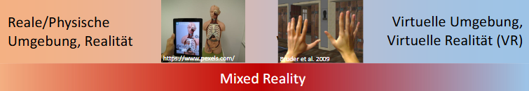

### Milgram Weiser Continuum
* Bezug zwischen Ubiquitousness & Virtualität

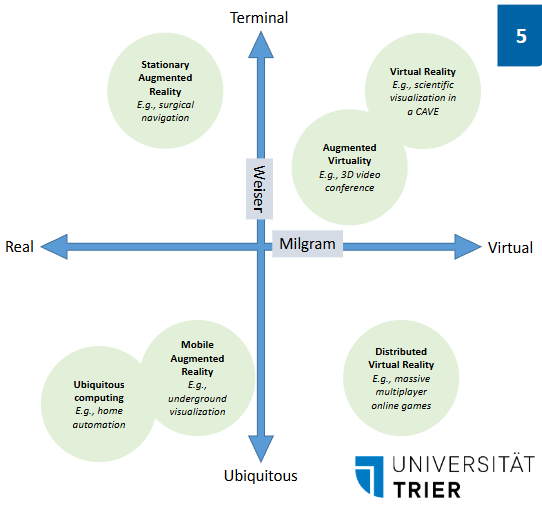

### AR Feedback Loop
* Nutzer beobachtet das Display und kontrolliert den Blickpunkt
* System verfolgt Blickpunkt und präsentiert passenden virtuellen Inhalt

### Beispiele

**Schwert des Damocles**

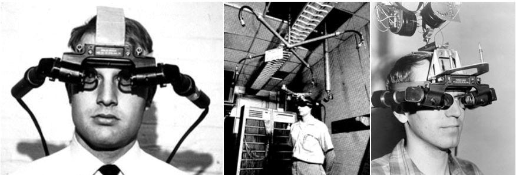

**Kabelbaum**

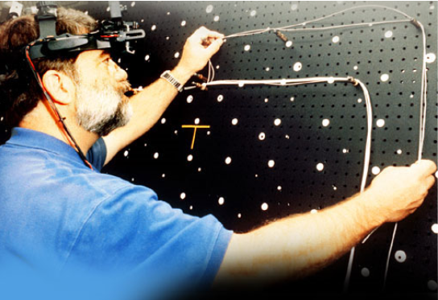

**Reparaturunterstützung**

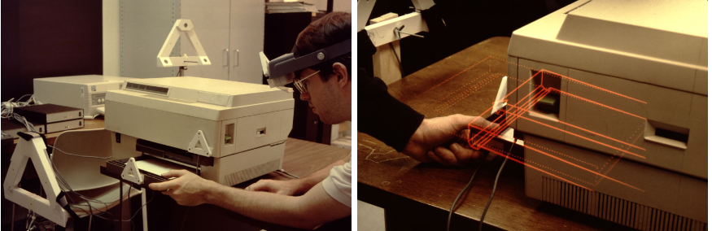

**Ultraschall Visualisierung**

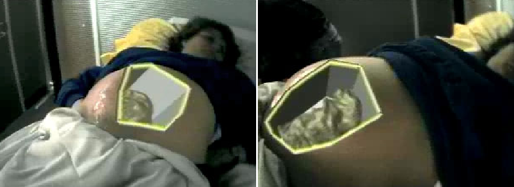

**Outdoor AR**

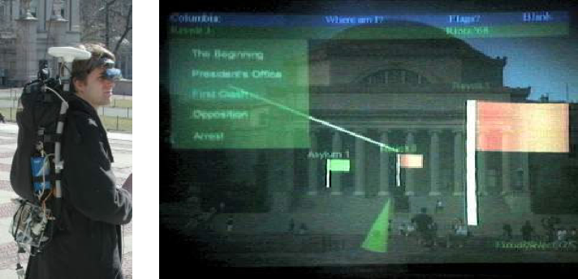

## Anwendungsfelder
* Industrie und Bau
* Wartung / Reparatur & Training
* Medizin
* Persönliches Informationsdisplay
* Navigation
* Fernsehen
* Werbung
* Spiele

**Diskrepanzanalyse**

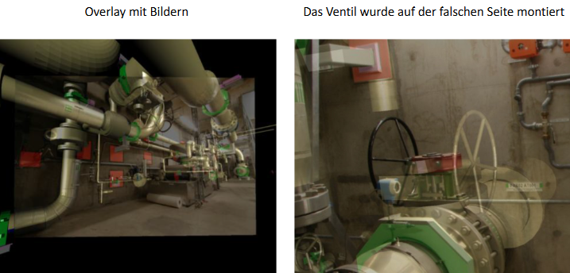

**Infrastruktur im Untergrund**

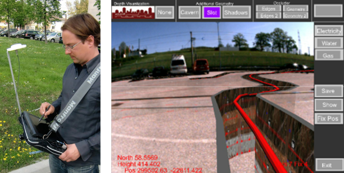

**Wartung & Training**

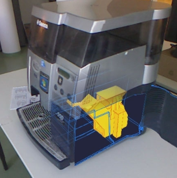

## Displays

### Tiefenwahrnehmung

**Stereoskopie**

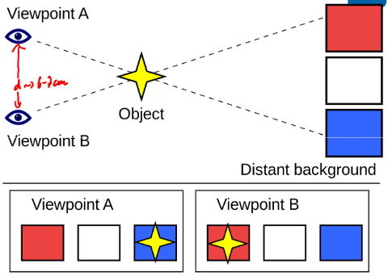

* Interokuläre Distanz ca. 6 cm
* Produzieren unterschiedliche Bilder
* Überlappen verschiedener Bilder im Hirn
* Tiefenwahrnehmung
* Bis zu 7m Entfernung

**Methoden zur Tiefenwahrnehmung**
* Verdeckung
* Stereoskopie
* Konvergenz
* Akkommodation (Anpassung der Linse durch Muskeln)
* Unschärfe
* Perspektive
* Oberflächenbeschaffenheit
* Relative Größe
* Bekannte Größe
* Höhe im Blickfeld
* Atmosphärische Perspektive
* Schatten
* Bewegungsparallaxe

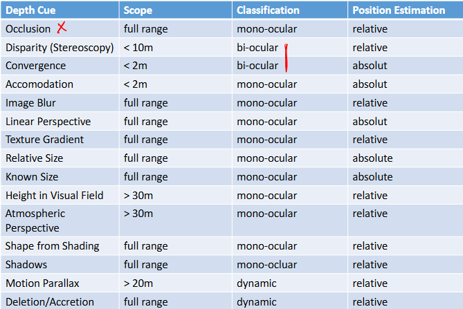

**Stereoskopie auf Bildschirmen**
* 1 Display pro Auge
    * evtl. Tracking der Brille
* 3d Brille
    * Verschiedene Bilder auf Display projeziert die nur 1 Linse druchdringen

### AR Displays

**Eigenschaften**
* Kombination Reales & Virtuelles Bild
* 3 allgemeine Ansätze
    1. Optical see-through
        * physische Welt ist weiter sichtbar
        * virtuelles Bild auf Linse projeziert
    2. Video see-through
        * physische Welt wird gefilmt
        * physisches & virtuelles Bild auf Display
    3. Spatial Projection

**Optical see-through**

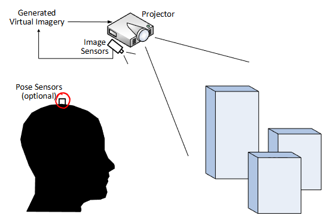

**Video see-through**

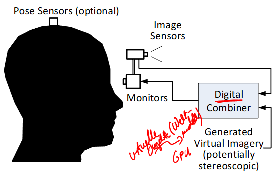

**Spatial Projection**

**AR Display Taxonomie**

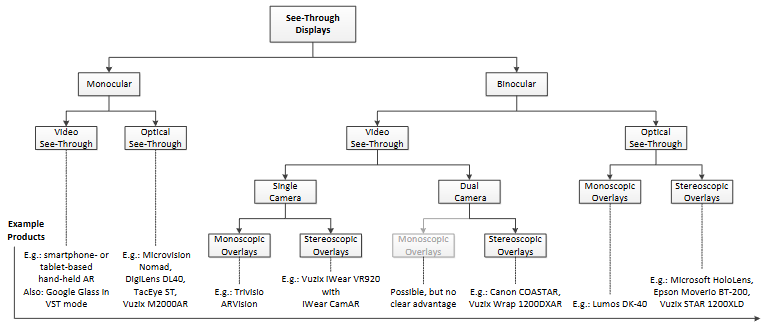

**Verdeckung von virtuellen & physischen Objekten**
* Verdeckung physisch durch physisch 
    * trivial
* Verdeckung virtuell durch virutell 
    * trivial 
* Verdeckung physich durch virtuell
    * Bei VST trivial (Z-Buffer) sofern Tiefenkamera
    * Bei OST problematisch, Lösungsansätze:
        1. Virtuelles Objekt sehr hell
        2. Unterstützung durch Projektoren in Bekannter Umgebung
        3. OST Display blendet aktiv Objekte aus z.B. mit LCD

**Weitere Eigenschaften**
* Auflösung / Wiederholrate (visuell & zeitlich) 
* FOV
* Blickpunktverschiebung
* Helligkeit und Kontrast
* Displayausfall
* Verzerrung
* Latenz
* Ergonomie
* Soziale Akzeptanz

**OST vs VST**

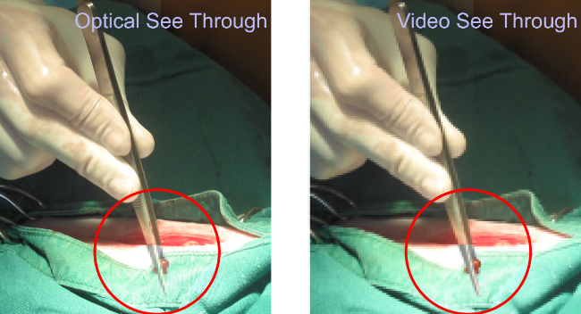

**Zeitliche Auflösung**
* Aufnahme / Bildgenerierung & Displaywiederholrate synchronisiert
* Hauptsächlich wichtig für Bewegung
* 60 Hz Flickerfrei, Fernsehen 25/30 Hz
    * Für VR / AR mindestens 60 Hz pro Auge

**Field of View**
* Abhängig von
    * Abstand Display -> Auge
    * Auflösung des Displays

**Viewpoint Offset**
* Allgemein -> Offset Kamera -> Auge unerwünscht

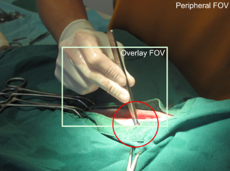

* COASTAR: Erstes parallax-freies VST Display

**Helligkeit und Kontrast**

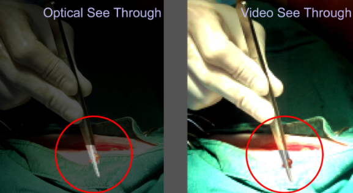

**Displayausfall**

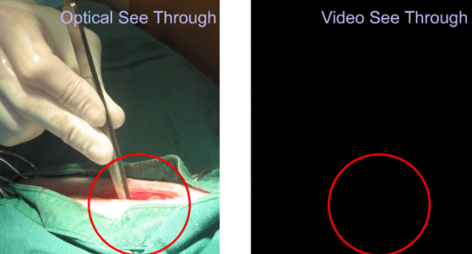

**Weitere Aspekte**
* Verzerrung
    * Probleme bei optischen Systemen auch für AR relevant
* Latenz
    * Hohe Latenz erzeugt Diskrepanz zwischen virtueller und realer Umgebung
    * Motion Sickness
    * Geringer wahrgenommene Qualität
* Ergonomie
    * Brillen immer Nachteilig für Komfort
    * HUD muss leicht genug sein
    * Hygiene
    * Tragekomfort
* Soziale Akzeptanz
    * Eigenartiges Aussehen
    * Privatsphäre -> Google Lense

### Spatial Display Model

**Transformationen**
* Um virtuelle Objekte korrekt im raum zu rendern sind Transformationen notwendig
    1. Model Transformation
        * Bezug Objekt -> Globales Koordinatensystem
    2. View Transformation
        * Position des Nutzers im Globalen Koordinatensystem
    3. Projektions Transformation
        * Projektion von 3D Koordinaten auf 2D Display

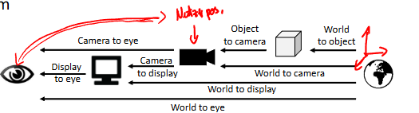

**Behandlung von Transformationen**
1. Statisch
    * Transformation fix
    * Offline Berechnung
    * Kalibration
2. Dynamisch
    * Tracking verfolgt Position von Objekten
    * Transformationen werden angepasst (Online)
        * Objekttracking für Position realer Objekte
        * Head (& Eye) Tracking für Blickrichtung
        * Display Tracking bei beweglichem Display
        * Kamera Tracking (VST)

Meistens wird beides verwendet. Theoretisch ist alles Dynamisch berechenbar, real werden allerdings meist 2 dynamisch berechnet, der Rest durch passiert statisch. z.B. durch Kalibrierung.

### Display Space Taxonomie

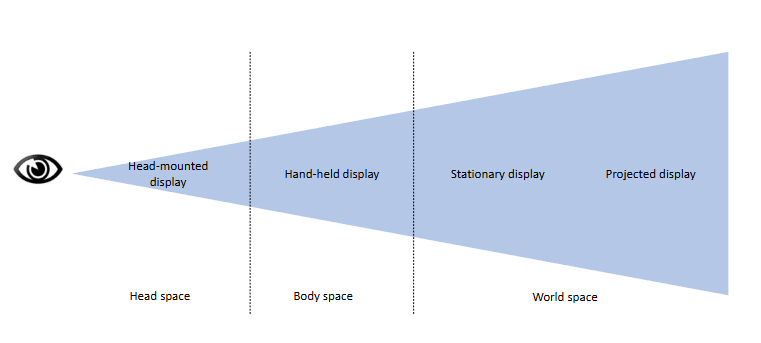

### Sonstige Displays

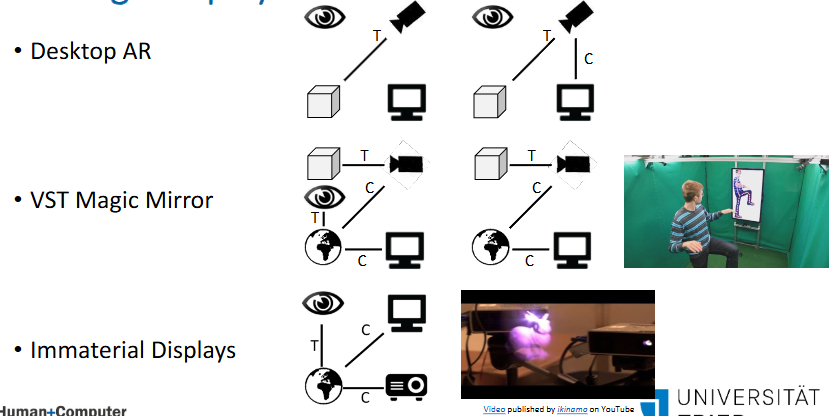

## Tracking

**Tracking, Kalibrierung, Registrierung**

* Registrierung
    * Anpassen an  räumliche Eigenschaften
* Kalibrierung
    * Offline Anpassung an Parameter
        * Räumliche Kalibrierung
        * Einmalig
* Tracking
    * Dynamisches Messen
        * VR / AR immer 3D Trakcing

### Koordinatensysteme & Bezugsrahmen

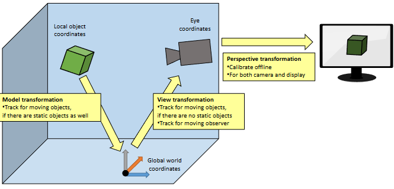

**Bezugsrahmen**
* World-stabilized
    * z.B. Straßenschild
* Object- / Body-stabilized
    * z.B. Virtueller Werkzeuggütel
* Screen-stabilized
    * z.B. Head-up Displays

### Eigenschaften von Tracking Systemen

* Was wird gemessen
    * Welche physikalischen Phänomene
    * Welche Koordinatensysteme manipuliert

* Charakteristiken:
    * Physikalische Phänomene
        * Schall
        * Strahlung
        * Schwerkraft
        * Trägheit
    * Aspekte der Messung
        * Signalstärke
        * Signalrichtung
        * Time to flight
    * Geometrische Eigenschaften
    * Sensoranordnung
    * Signalquelle
    * Freiheitsgrade
    * Koordinatenmessung
    * Räumliche Sensoranordnung
    * Abdeckung
    * Messfehler
    * zeitliche Eigenschaften

**Geometrische Eigenschaften der Messung**

1. Trilateration
    * Bestimmung durch von Distanz
    * Drei Messpunkte
    * Schnittpunkt von Kreisen bestimmt Position
2. Triangulation
    * Bestimmung durch Winkel
    * Zwei Messpunkte
    * Distanz zwischen Messpunkten bekannt
    * Durch Winkel α1 & α2

**Sensoranordnung**

* Häufig komplex
* Herausforderungen:
    1. Synchronisation
    2. Sensorfusion
        * Alle Sensoren bilden ein Gesamtbild
    3. Kalibrierung
        * Distanz zwischen Sensoren muss stimmen

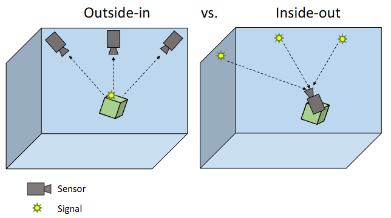

**Signalquelle**
* Signale in Räumlicher Umgebung platziert
* Passive Quellen
    * Umgbungslicht
    * Erdanziehung
    * andere natürliche Signale
* Aktive Quellen
    * Direkte aktive Quellen
        * An zu trackendem Objekt
    * Indirekte aktive Quellen
        * Objekt reflektiert Signale
        * Signalemitter und Objekt nicht an gleicher Stelle
        * Benötigt Wissen über Form von Reflektoren

**Freiheitsgrade**

* Anzahl der gemessenen Achsen
* DOF
* 6 DOF für 3D + Rotation um alle Achsen
    * 3 DOF für Position
    * 3 DOF für Rotation

**Messung von Koordinaten**

* Abhängig vom Bezugssystem
* Global vs. Lokal
* Absolut
    * Referenzsystem vorab definiert
* Relativ
    * Dynamisch erzeugt

**Weitere Aspekte**

* Abdeckung
* Messfehler
    * Systematisch
        * Versatz
        * Skalierungsfehler
    * Zufällig
        * Signalrauschen
        * Jitter
    * Accuracy
        * Nähe des gemessenem zum realen Wert
        * Abhängig von systematischem Fehler
        * Kompensation u.a. durch bessere Kalibrierung
    * Precision
        * Nähe gemessener Were zueinander
        * Abhängig von zufälligem Fehler
        * Kompensation durch Filter -> Latenz
        * Anzahl Sensoren / Sensorqualität
    * Auflösung
        * Minimale Distanz zwischen zu unterscheidenden Messwerten
* Zeit
    * Latenz
    * Wiederholrate

**Stationäre Trackingsysteme**
* Meschanisches Tracking
* Elektromagnetisches Tracking
* Akustisches Tracking
* Opto-elektronisches Tracking

**Mobiles Tracking**
* Flexibler
* In mobilen Geräten verbaut

**GPS**
* mindestens 4 Satelliten
* 10m genauigkeit
* Verbesserung durch Basisstation
    * Kompensiert Störung z.B. durch die Atmosphäre

**Wireless Networks**
* WiFi, Bluetooth, etc.
    * Können zur Positionsbestimmung verwendet werden
* Basisstationen durch ID eindeutig bestimmbar
    * ID auslesbar
    * Signalstärkenmessung
    * Fingerprinting

**Inertial Sensorik**
* Magnetometer (elektronischer Kompass)
* Gyroskop
* Linearbeschleunigungssensor

### Marker und Feature Tracking

**Grundidee**

* Zu trackende Objekte werden aufgeteilt
    * Künstliche Marker
        * Virtuelles Target muss erst physisch produziert werden
    * Natürliche Feature
        * Muss virtuell erzeugt werden
* Computer Vision
    * Bildverarbeitung
    * Feature Extraction
    * Klassifizierung

**Marker based**
* Bekannte Muster werden platziert
* Einfach zu messend
    * Uniforme Farbe
    * Stabile Repräsentation
    * Eindeutig

**Tracking von Umgebungseigenschaften**
* Kamerabild
    * Sehr hohe Qualität nötig
* POIs
* Kanten

## Interaktion

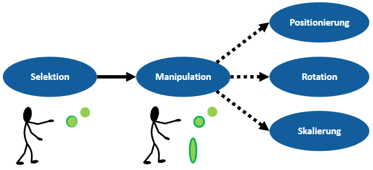

### Eingabegeräte

**6 DOF**

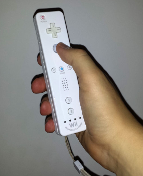

**Hand & Finger Tracking**
* Bend-sensing gloves
    * Jedes Gelenk
    * Gesten
* Pinch Gloves
    * Messen ob Fingerspitzen berühren

**Body Tracking**
* Gesten Basierte Interaktion
* Berührung
* Tangible
* Erweitertes Papier

**Magische Linse**

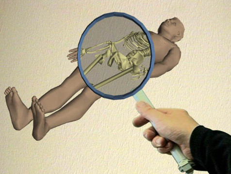

**Conversational Agents**
* KI Agenten zur Interaktion

### Computer unterstützte kooperative Arbeit

**Grundlagen**
* Ziel:
    * Zusammenarbeit ermöglichen
    * Verbessern
* Verschiedene Systeme

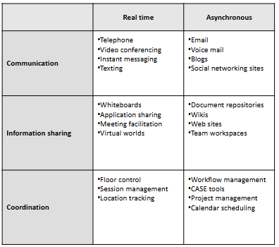

**Matrix**
* Kooperation
    * Gruppe von Personen
    * Individuelle Ziele
* Kollaboration
    * Gruppe von Personen
    * gemeinsames Ziel

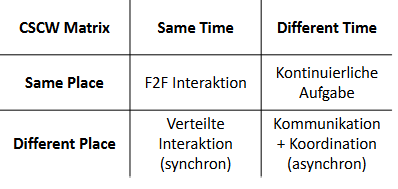

**CSCW im AR / VR Kontext**

* Kollaborative Umgebungen
* Geteilte Virtuelle Umgebung
* Verschiedene Nutzerrollen
    * Primary
        * Kontrolle über Umgebung
        * Liegert größten Beitrag
    * Secondary
        * Empfängt und reagiert
* Asymmetrisch vs Symmetrisch
* Anwendungsfelder:
    * Telewartung
    * Teleüberwachung
    * Telelehre
    * Telesteuerung
    * Telekollaboration
    * Teleanwesenheit