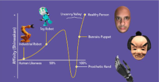

# Embodied Conversational Agents

## Definition

Conversational Agents ⊇ Embodied Conversational Agents ⊇ Virtual Humans ⊇ Roboter

### Fünf Wellen

1. Zero-hour Wave
    * Scripted CAs
    * Turing-proof
    * Statistische Methoden
    * NLP
    * Geskriptete Emotionen
    * ELIZA

2. Explore Wave
    * "KI"
    * Mustererkennung
    * Embodied CAs
    * Affektive CAs
    * A.L.I.C.E

3. Kick-off Wave
    * Frameworks
    * Conversational Agents etabliert
    * Experimentelle Benutzung
    * Reale Nutzung
    * Big Tech
    * IBM Watson

4. Hype Wave
    * AI "lite"
    * Omnipräsente CAs
    * Stimmbasierte CAs
    * Fortschrittliche NLP
    * CA Hype
    * Ontologie & Semantik
    * Siri, Alexa, Google Assistant

5. AI Wave
    * "True" AI
    * Vollautomatisiert
    * NLU, kNN
    * Adaptive KI
    * Selbstlernende KI
    * Autonome CA
    * 100B + LLMS
    * ChatGPT

### Media Equation

* Interaktion mit Computern sozial

**Computers Are Social Actors**

* Computer als Teammitglieder?
* gegenseitige Abhängigkeit
* Identität
* soziale Regeln werden auf Computersysteme übertragen

**Conversational Agents vs Embodied Conversational Agents**

* Bieten mehr soziale Signale
    * Mehr Informationen für Nutzer
* Verbale und nonverbale Signale
* Abwechselnde Gesprächsinteraktion

**Gestaltung von ECAs**

* Design nicht nur kosmetisch
* sozial wirksam
* Verbale Kommunikation
    * natürliche Sprache
* Non-Verbale Kommunikation
    * Mimik 
    * Gesten
    * Blick
* Intelligente Interaktion im Wechsel
    * Timing Entscheidend
    * Beeinflusst wahrgenommene Intelligenz
* Soziale Rolle
    * Experten-Framing
    * Kongruenz
    * Beeinflusst Akzeptanz
* Haltung
    * Beeinflusst Erwartung an Interaktion
* Gesten
    * ikonisch
        * Geste beschreibt Objekt
    * metaphorisch
        * Geste beschreibt Idee
    * deiktisch
        * Geste beschreibt räumlichen Punkt
    * beat
        * rhytmische begleitende Geste
    * emblem
        * kulturelle Bedeutung
* Blickkontakt & Blickrichtung
    * Aufmerksamkeit
    * Kollaboration
* Anthropomorphismus
* Realismus
    * Cartoon
    * menschlich
* Gesichtsausdrücke
* Natürliche Interaktion
    * Vorgenerierte Sätze
    * Animationen
* KI Modelle
    * Speech to text
    * Text to speech

**Uncanny Valley**

**Ethische Fragen**
* Sozialer -> überzeugender
* ECAs anthropmorphisierter
* Überzeugung vs Manipulation